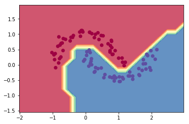

# unfinished-micrograd


Forked and detached from [micrograd](https://github.com/karpathy/micrograd) (don't look,
spoilers!), for educational purposes. This tiny API for machine learning has all the same bite as
the original, but none of the functions are written! THey have been replaced with `TODO` items and
`NotImplementedError`s for students to complete.

### Installation

```bash
git clone git@github.com:benjamindkilleen/unfinished-micrograd.git
pip install -e micrograd
```

### Instructions

Students should replace each `NotImplementedError` with an implementation that accomplishes the
specified function description. Simply running the code, as described below, will raise these
errors in a good implementation order, but it is suggested that the student start in
`micrograd/engine.py` and complete the `Value` class, then move on to tackle the API in
`micrograd/nn.py`.

### Example usage

Below is a slightly contrived example showing a number of possible supported operations:

```python
from micrograd.engine import Value

a = Value(-4.0)
b = Value(2.0)
c = a + b
d = a * b + b**3
c += c + 1
c += 1 + c + (-a)
d += d * 2 + (b + a).relu()
d += 3 * d + (b - a).relu()
e = c - d
f = e**2
g = f / 2.0
g += 10.0 / f
print(f'{g.data:.4f}') # prints 24.7041, the outcome of this forward pass
g.backward()
print(f'{a.grad:.4f}') # prints 138.8338, i.e. the numerical value of dg/da
print(f'{b.grad:.4f}') # prints 645.5773, i.e. the numerical value of dg/db
```

### Training a neural net

The notebook `demo.ipynb` provides a full demo of training an 2-layer neural network (MLP) binary
classifier. This is achieved by initializing a neural net from `micrograd.nn` module, implementing
a simple svm "max-margin" binary classification loss and using SGD for optimization. As shown in
the notebook, using a 2-layer neural net with two 16-node hidden layers we achieve the following
decision boundary on the moon dataset:



### Tracing / visualization

For added convenience, the notebook `trace_graph.ipynb` produces graphviz visualizations. E.g. this
one below is of a simple 2D neuron, arrived at by calling `draw_dot` on the code below, and it
shows both the data (left number in each node) and the gradient (right number in each node).

```python
from micrograd import nn
n = nn.Neuron(2)
x = [Value(1.0), Value(-2.0)]
y = n(x)
dot = draw_dot(y)
```


### Running tests

To run the unit tests you will have to install [PyTorch](https://pytorch.org/), which the tests use
as a reference for verifying the correctness of the calculated gradients. Then simply:

```bash
python -m pytest
```

### License

MIT
